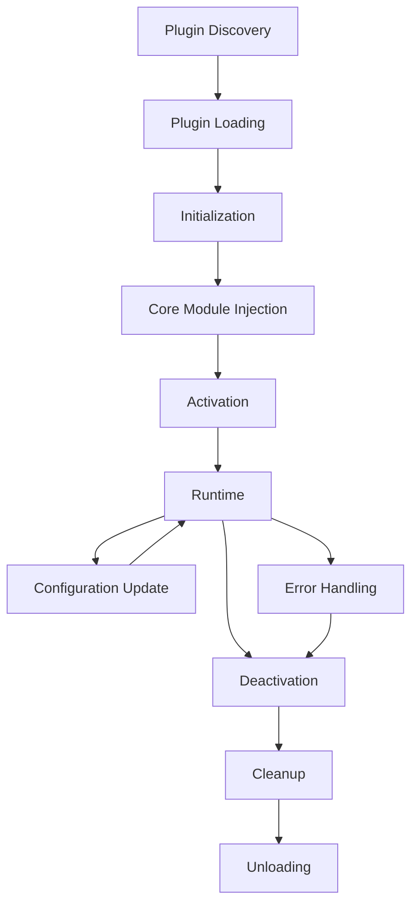

# Architecture Guide - LaboonChat2

> **Guida completa all'architettura del sistema per architetti e sviluppatori senior**

Questo documento descrive l'architettura di LaboonChat2, le decisioni di design, i pattern utilizzati e le considerazioni tecniche che guidano lo sviluppo del sistema.

## 📋 Indice

- [Panoramica Architetturale](#panoramica-architetturale)
- [Principi di Design](#principi-di-design)
- [Architettura Modulare](#architettura-modulare)
- [Sistema di Plugin](#sistema-di-plugin)
- [Gestione della Sicurezza](#gestione-della-sicurezza)
- [Architettura di Rete](#architettura-di-rete)
- [Gestione dei Dati](#gestione-dei-dati)
- [Pattern e Pratiche](#pattern-e-pratiche)
- [Scalabilità e Performance](#scalabilità-e-performance)
- [Considerazioni di Sicurezza](#considerazioni-di-sicurezza)
- [Deployment e DevOps](#deployment-e-devops)

---

## Panoramica Architetturale

### Visione di Alto Livello

LaboonChat2 è progettato come un sistema modulare e estensibile per comunicazioni P2P sicure. L'architettura segue i principi di **separation of concerns**, **dependency inversion** e **plugin-based extensibility**.

```
┌─────────────────────────────────────────────────────────────────┐
│                        LaboonChat2                             │
│                     Application Layer                          │
├─────────────────────────────────────────────────────────────────┤
│                    Plugin Ecosystem                            │
│  ┌─────────────────┐  ┌─────────────────┐  ┌─────────────────┐ │
│  │   Secondary     │  │   Secondary     │  │   Secondary     │ │
│  │   Plugins       │  │   Plugins       │  │   Plugins       │ │
│  │  (ChatBot,      │  │ (FileSharing,   │  │ (Encryption,    │ │
│  │   Themes, ...)  │  │  Backup, ...)   │  │  Analytics,...) │ │
│  └─────────────────┘  └─────────────────┘  └─────────────────┘ │
├─────────────────────────────────────────────────────────────────┤
│                      Core Modules                              │
│  ┌─────────────────┐  ┌─────────────────┐  ┌─────────────────┐ │
│  │    Security     │  │   Messaging     │  │    Network      │ │
│  │    Module       │  │    Module       │  │    Module       │ │
│  └─────────────────┘  └─────────────────┘  └─────────────────┘ │
│  ┌─────────────────┐  ┌─────────────────┐  ┌─────────────────┐ │
│  │   Interface     │  │  Configuration  │  │     Plugin      │ │
│  │    Module       │  │    Manager      │  │    Manager      │ │
│  └─────────────────┘  └─────────────────┘  └─────────────────┘ │
├─────────────────────────────────────────────────────────────────┤
│                    Foundation Layer                            │
│  ┌─────────────────┐  ┌─────────────────┐  ┌─────────────────┐ │
│  │   Core          │  │    Event        │  │    Utility      │ │
│  │  Interfaces     │  │    System       │  │   Functions     │ │
│  └─────────────────┘  └─────────────────┘  └─────────────────┘ │
├─────────────────────────────────────────────────────────────────┤
│                   Infrastructure Layer                         │
│  ┌─────────────────┐  ┌─────────────────┐  ┌─────────────────┐ │
│  │   Networking    │  │   Persistence   │  │   Cryptography  │ │
│  │  (asyncio,      │  │   (SQLite,      │  │  (cryptography, │ │
│  │   sockets)      │  │    files)       │  │    hashlib)     │ │
│  └─────────────────┘  └─────────────────┘  └─────────────────┘ │
└─────────────────────────────────────────────────────────────────┘
```

### Caratteristiche Architetturali

- **🏗️ Modulare**: Separazione chiara delle responsabilità
- **🔌 Estensibile**: Sistema di plugin per nuove funzionalità
- **🔄 Asincrono**: Operazioni non-bloccanti con asyncio
- **🛡️ Sicuro**: Security by design in ogni livello
- **🧪 Testabile**: Dependency injection e mock-friendly
- **📊 Osservabile**: Logging, metriche e monitoring integrati

---

## Principi di Design

### 1. Separation of Concerns

Ogni modulo ha una responsabilità specifica e ben definita:

```python
# Esempio di separazione delle responsabilità
class SecurityModule:
    """Responsabile SOLO della sicurezza"""
    async def encrypt_data(self, data: bytes) -> bytes: ...
    async def decrypt_data(self, data: bytes) -> bytes: ...

class MessagingModule:
    """Responsabile SOLO della messaggistica"""
    async def send_message(self, message: str) -> bool: ...
    async def receive_message(self) -> str: ...

class NetworkModule:
    """Responsabile SOLO della rete"""
    async def connect_peer(self, address: str) -> bool: ...
    async def send_data(self, data: bytes) -> bool: ...
```

### 2. Dependency Inversion

I moduli dipendono da astrazioni, non da implementazioni concrete:

```python
# Interfaccia astratta
class ISecurityModule(ABC):
    @abstractmethod
    async def encrypt_data(self, data: bytes) -> bytes: ...

# Implementazione concreta
class BasicSecurity(ISecurityModule):
    async def encrypt_data(self, data: bytes) -> bytes:
        # Implementazione specifica
        pass

# Utilizzo tramite interfaccia
class MessagingModule:
    def __init__(self, security: ISecurityModule):
        self.security = security  # Dipende dall'interfaccia, non dall'implementazione
```

### 3. Plugin-Based Extensibility

Il sistema è estensibile tramite plugin senza modificare il core:

```python
# Plugin interface
class ISecondaryPlugin(ABC):
    @abstractmethod
    async def initialize(self, config: Dict[str, Any]) -> bool: ...

# Plugin implementation
class ChatBotPlugin(ISecondaryPlugin):
    async def initialize(self, config: Dict[str, Any]) -> bool:
        # Estende funzionalità senza modificare il core
        pass
```

### 4. Event-Driven Architecture

Comunicazione tra moduli tramite eventi:

```python
# Event emitter
class EventEmitter:
    def emit(self, event: str, data: Any) -> None: ...
    def on(self, event: str, handler: Callable) -> None: ...

# Utilizzo
messaging.on("message_received", security.handle_incoming_message)
network.on("peer_connected", messaging.handle_new_peer)
```

---

## Architettura Modulare

### Core Modules

#### Security Module

**Responsabilità**: Gestione di tutta la sicurezza del sistema

```python
class ISecurityModule(ABC):
    """Interfaccia per moduli di sicurezza."""
    
    # Identity Management
    async def create_identity(self, display_name: str) -> str: ...
    async def get_public_key(self) -> str: ...
    
    # Encryption/Decryption
    async def encrypt_message(self, message: str, recipient_id: str) -> bytes: ...
    async def decrypt_message(self, encrypted_data: bytes, sender_id: str) -> str: ...
    
    # Digital Signatures
    async def sign_data(self, data: bytes) -> bytes: ...
    async def verify_signature(self, data: bytes, signature: bytes, signer_id: str) -> bool: ...
    
    # Peer Management
    async def add_trusted_peer(self, peer_id: str, public_key: str) -> bool: ...
```

**Design Patterns**:
- **Strategy Pattern**: Diversi algoritmi di crittografia
- **Factory Pattern**: Creazione di chiavi e certificati
- **Observer Pattern**: Notifiche di eventi di sicurezza

#### Messaging Module

**Responsabilità**: Gestione dei messaggi e della comunicazione

```python
class IMessagingModule(ABC):
    """Interfaccia per moduli di messaggistica."""
    
    # Message Operations
    async def send_message(self, recipient_id: str, message: str, message_type: str = "text") -> bool: ...
    async def broadcast_message(self, message: str, message_type: str = "text") -> List[str]: ...
    
    # History Management
    async def get_message_history(self, peer_id: Optional[str] = None, limit: int = 100) -> List[Dict[str, Any]]: ...
    async def mark_message_read(self, message_id: str) -> bool: ...
    
    # Event Handling
    async def register_message_handler(self, handler: callable) -> None: ...
```

**Design Patterns**:
- **Command Pattern**: Operazioni sui messaggi
- **Observer Pattern**: Handler per messaggi in arrivo
- **Repository Pattern**: Persistenza dei messaggi

#### Network Module

**Responsabilità**: Gestione delle connessioni di rete P2P

```python
class INetworkModule(ABC):
    """Interfaccia per moduli di rete."""
    
    # Connection Management
    async def start_listening(self, port: int) -> bool: ...
    async def connect_to_peer(self, peer_address: str, peer_port: int) -> str: ...
    async def disconnect_from_peer(self, peer_id: str) -> bool: ...
    
    # Data Transfer
    async def send_data(self, peer_id: str, data: bytes) -> bool: ...
    async def broadcast_data(self, data: bytes) -> List[str]: ...
    
    # Discovery
    async def discover_peers(self) -> List[Dict[str, Any]]: ...
```

**Design Patterns**:
- **Adapter Pattern**: Diversi protocolli di rete
- **Proxy Pattern**: Gestione connessioni
- **State Pattern**: Stati delle connessioni

#### Interface Module

**Responsabilità**: Gestione dell'interfaccia utente

```python
class IInterfaceModule(ABC):
    """Interfaccia per moduli di interfaccia utente."""
    
    # Interface Lifecycle
    async def start_interface(self) -> bool: ...
    async def stop_interface(self) -> None: ...
    
    # Display Operations
    async def display_message(self, message: Dict[str, Any]) -> None: ...
    async def display_notification(self, notification: Dict[str, Any]) -> None: ...
    async def update_peer_list(self, peers: List[Dict[str, Any]]) -> None: ...
```

**Design Patterns**:
- **MVC Pattern**: Separazione logica/presentazione
- **Template Method**: Rendering dell'interfaccia
- **Decorator Pattern**: Temi e personalizzazioni

### Module Interactions

```python
# Esempio di interazione tra moduli
class ApplicationCore:
    def __init__(self):
        self.security = BasicSecurity()
        self.messaging = SimpleMessaging()
        self.network = SimpleNetwork()
        self.interface = WebInterface()
        
        # Setup dependencies
        self.messaging.set_security_module(self.security)
        self.messaging.set_network_module(self.network)
        self.interface.set_messaging_module(self.messaging)
        
        # Setup event handlers
        self.network.on("peer_connected", self.messaging.handle_peer_connected)
        self.messaging.on("message_received", self.interface.display_message)
        self.security.on("encryption_failed", self.handle_security_error)
```

---

## Sistema di Plugin

### Plugin Architecture

Il sistema di plugin permette estensioni modulari senza modificare il core:

```python
# Plugin Registry
class PluginRegistry:
    def __init__(self):
        self.plugins: Dict[str, ISecondaryPlugin] = {}
        self.plugin_configs: Dict[str, Dict[str, Any]] = {}
    
    async def load_plugin(self, plugin_name: str, plugin_class: Type[ISecondaryPlugin]) -> bool:
        """Carica un plugin nel sistema."""
        try:
            plugin = plugin_class()
            config = self.plugin_configs.get(plugin_name, {})
            
            if await plugin.initialize(config):
                self.plugins[plugin_name] = plugin
                await plugin.set_core_modules(self.get_core_modules())
                await plugin.activate()
                return True
        except Exception as e:
            logger.error(f"Failed to load plugin {plugin_name}: {e}")
        return False
```

### Plugin Lifecycle



### Plugin Categories

#### Secondary Plugins

Plugin che estendono funzionalità senza sostituire moduli core:

```python
# Esempio: ChatBot Plugin
class ChatBotPlugin(ISecondaryPlugin):
    def __init__(self):
        self.ai_model = None
        self.core_modules = {}
    
    async def initialize(self, config: Dict[str, Any]) -> bool:
        self.ai_model = self.load_ai_model(config.get("model_path"))
        return self.ai_model is not None
    
    async def handle_message(self, message: Dict[str, Any]) -> None:
        if message["content"].startswith("/bot"):
            response = await self.ai_model.generate_response(message["content"])
            await self.core_modules["messaging"].send_message(
                message["sender_id"], response
            )
```

### Plugin Communication

I plugin comunicano tramite:

1. **Core Module APIs**: Accesso alle funzionalità core
2. **Event System**: Comunicazione asincrona
3. **Shared State**: Stato condiviso tramite ConfigManager

```python
# Plugin communication example
class FileSharePlugin(ISecondaryPlugin):
    async def share_file(self, file_path: str, peer_id: str) -> bool:
        # 1. Use Security Module for encryption
        encrypted_data = await self.core_modules["security"].encrypt_file(file_path)
        
        # 2. Use Network Module for transfer
        success = await self.core_modules["network"].send_data(peer_id, encrypted_data)
        
        # 3. Emit event for other plugins
        self.emit("file_shared", {"file": file_path, "peer": peer_id, "success": success})
        
        return success
```

---

## Gestione della Sicurezza

### Security Architecture

La sicurezza è implementata a più livelli:

```
┌─────────────────────────────────────────────────────────────┐
│                    Application Security                    │
├─────────────────────────────────────────────────────────────┤
│  ┌─────────────────┐  ┌─────────────────┐  ┌─────────────┐ │
│  │   Input         │  │   Authorization │  │   Audit     │ │
│  │  Validation     │  │   & Access      │  │   Logging   │ │
│  │                 │  │   Control       │  │             │ │
│  └─────────────────┘  └─────────────────┘  └─────────────┘ │
├─────────────────────────────────────────────────────────────┤
│                    Transport Security                      │
│  ┌─────────────────┐  ┌─────────────────┐  ┌─────────────┐ │
│  │   End-to-End    │  │   Perfect       │  │   Message   │ │
│  │   Encryption    │  │   Forward       │  │   Integrity │ │
│  │                 │  │   Secrecy       │  │             │ │
│  └─────────────────┘  └─────────────────┘  └─────────────┘ │
├─────────────────────────────────────────────────────────────┤
│                     Data Security                          │
│  ┌─────────────────┐  ┌─────────────────┐  ┌─────────────┐ │
│  │   Data at Rest  │  │   Key           │  │   Secure    │ │
│  │   Encryption    │  │   Management    │  │   Storage   │ │
│  │                 │  │                 │  │             │ │
│  └─────────────────┘  └─────────────────┘  └─────────────┘ │
├─────────────────────────────────────────────────────────────┤
│                   Identity Security                        │
│  ┌─────────────────┐  ┌─────────────────┐  ┌─────────────┐ │
│  │   Digital       │  │   Peer          │  │   Identity  │ │
│  │   Signatures    │  │   Authentication│  │   Verification│ │
│  │                 │  │                 │  │             │ │
│  └─────────────────┘  └─────────────────┘  └─────────────┘ │
└─────────────────────────────────────────────────────────────┘
```

### Cryptographic Design

```python
class CryptographicCore:
    """Core crittografico del sistema."""
    
    def __init__(self):
        self.key_manager = KeyManager()
        self.cipher_suite = CipherSuite()
        self.signature_engine = SignatureEngine()
    
    async def encrypt_message(self, message: str, recipient_public_key: str) -> EncryptedMessage:
        """Crittografia end-to-end di un messaggio."""
        # 1. Generate ephemeral key pair for PFS
        ephemeral_private, ephemeral_public = self.key_manager.generate_ephemeral_keypair()
        
        # 2. Derive shared secret using ECDH
        shared_secret = self.key_manager.derive_shared_secret(
            ephemeral_private, recipient_public_key
        )
        
        # 3. Derive encryption key using HKDF
        encryption_key = self.key_manager.derive_encryption_key(shared_secret)
        
        # 4. Encrypt message using AES-GCM
        ciphertext, nonce, tag = self.cipher_suite.encrypt_aes_gcm(
            message.encode(), encryption_key
        )
        
        # 5. Sign the encrypted message
        signature = await self.signature_engine.sign(
            ciphertext + nonce + tag, self.key_manager.get_private_key()
        )
        
        return EncryptedMessage(
            ciphertext=ciphertext,
            nonce=nonce,
            tag=tag,
            ephemeral_public_key=ephemeral_public,
            signature=signature
        )
```

### Key Management

```python
class KeyManager:
    """Gestione sicura delle chiavi crittografiche."""
    
    def __init__(self):
        self.master_key = None
        self.key_store = SecureKeyStore()
        self.key_rotation_scheduler = KeyRotationScheduler()
    
    async def initialize(self, password: str) -> bool:
        """Inizializza il key manager con password utente."""
        # Derive master key from password
        salt = self.get_or_generate_salt()
        self.master_key = self.derive_master_key(password, salt)
        
        # Load or generate identity keys
        if not await self.load_identity_keys():
            await self.generate_identity_keys()
        
        # Start key rotation scheduler
        await self.key_rotation_scheduler.start()
        
        return True
    
    def derive_master_key(self, password: str, salt: bytes) -> bytes:
        """Deriva la chiave master dalla password utente."""
        return PBKDF2HMAC(
            algorithm=hashes.SHA256(),
            length=32,
            salt=salt,
            iterations=100000,
        ).derive(password.encode())
```

---

## Architettura di Rete

### P2P Network Design

LaboonChat2 implementa una rete P2P ibrida con discovery automatico:

```python
class P2PNetwork:
    """Implementazione della rete P2P."""
    
    def __init__(self):
        self.peer_manager = PeerManager()
        self.connection_pool = ConnectionPool()
        self.discovery_service = DiscoveryService()
        self.routing_table = RoutingTable()
    
    async def start_network(self, port: int) -> bool:
        """Avvia la rete P2P."""
        # 1. Start listening for incoming connections
        await self.start_listening(port)
        
        # 2. Start peer discovery
        await self.discovery_service.start_discovery()
        
        # 3. Connect to bootstrap peers
        await self.connect_to_bootstrap_peers()
        
        # 4. Start maintenance tasks
        await self.start_maintenance_tasks()
        
        return True
```

### Connection Management

```python
class ConnectionPool:
    """Pool di connessioni P2P."""
    
    def __init__(self, max_connections: int = 50):
        self.connections: Dict[str, PeerConnection] = {}
        self.max_connections = max_connections
        self.connection_quality_monitor = ConnectionQualityMonitor()
    
    async def add_connection(self, peer_id: str, connection: PeerConnection) -> bool:
        """Aggiunge una nuova connessione al pool."""
        if len(self.connections) >= self.max_connections:
            # Remove lowest quality connection
            await self.remove_lowest_quality_connection()
        
        self.connections[peer_id] = connection
        await self.connection_quality_monitor.start_monitoring(peer_id, connection)
        return True
    
    async def send_data(self, peer_id: str, data: bytes) -> bool:
        """Invia dati a un peer specifico."""
        connection = self.connections.get(peer_id)
        if not connection or not connection.is_active():
            # Try to reconnect
            if not await self.reconnect_peer(peer_id):
                return False
            connection = self.connections[peer_id]
        
        return await connection.send_data(data)
```

### Message Routing

```python
class MessageRouter:
    """Router per messaggi P2P."""
    
    def __init__(self):
        self.routing_table = RoutingTable()
        self.message_cache = MessageCache()
        self.flood_control = FloodControl()
    
    async def route_message(self, message: P2PMessage) -> bool:
        """Instrada un messaggio verso la destinazione."""
        # 1. Check if message is for us
        if message.recipient_id == self.get_local_peer_id():
            await self.deliver_locally(message)
            return True
        
        # 2. Check message cache to prevent loops
        if self.message_cache.has_seen(message.message_id):
            return False
        
        # 3. Add to cache
        self.message_cache.add(message.message_id)
        
        # 4. Find route to destination
        next_hop = self.routing_table.get_next_hop(message.recipient_id)
        
        if next_hop:
            # Direct route available
            return await self.send_to_peer(next_hop, message)
        else:
            # Flood to all peers (with flood control)
            return await self.flood_message(message)
```

---

## Gestione dei Dati

### Data Architecture

```python
class DataManager:
    """Gestore centralizzato dei dati."""
    
    def __init__(self):
        self.message_store = MessageStore()
        self.peer_store = PeerStore()
        self.config_store = ConfigStore()
        self.file_store = FileStore()
        self.cache_manager = CacheManager()
    
    async def initialize(self, data_directory: str) -> bool:
        """Inizializza il gestore dati."""
        # Setup data directory structure
        self.setup_data_directory(data_directory)
        
        # Initialize stores
        await self.message_store.initialize(f"{data_directory}/messages.db")
        await self.peer_store.initialize(f"{data_directory}/peers.db")
        await self.config_store.initialize(f"{data_directory}/config.json")
        await self.file_store.initialize(f"{data_directory}/files")
        
        # Setup cache
        await self.cache_manager.initialize()
        
        return True
```

### Message Persistence

```python
class MessageStore:
    """Store per la persistenza dei messaggi."""
    
    def __init__(self):
        self.db_connection = None
        self.encryption_key = None
    
    async def store_message(self, message: Message) -> bool:
        """Memorizza un messaggio nel database."""
        try:
            # Encrypt message content before storing
            encrypted_content = await self.encrypt_content(message.content)
            
            # Store in database
            await self.db_connection.execute("""
                INSERT INTO messages (id, sender_id, recipient_id, content, 
                                    message_type, timestamp, encrypted)
                VALUES (?, ?, ?, ?, ?, ?, ?)
            """, (
                message.id, message.sender_id, message.recipient_id,
                encrypted_content, message.message_type, message.timestamp, True
            ))
            
            await self.db_connection.commit()
            return True
        except Exception as e:
            logger.error(f"Failed to store message: {e}")
            return False
```

### Caching Strategy

```python
class CacheManager:
    """Gestore della cache multi-livello."""
    
    def __init__(self):
        self.memory_cache = MemoryCache(max_size=1000)
        self.disk_cache = DiskCache(max_size_mb=100)
        self.cache_policies = CachePolicies()
    
    async def get(self, key: str) -> Optional[Any]:
        """Recupera un valore dalla cache."""
        # 1. Try memory cache first
        value = self.memory_cache.get(key)
        if value is not None:
            return value
        
        # 2. Try disk cache
        value = await self.disk_cache.get(key)
        if value is not None:
            # Promote to memory cache
            self.memory_cache.set(key, value)
            return value
        
        return None
    
    async def set(self, key: str, value: Any, ttl: Optional[int] = None) -> None:
        """Memorizza un valore nella cache."""
        # Determine cache level based on policies
        cache_level = self.cache_policies.determine_cache_level(key, value)
        
        if cache_level >= CacheLevel.MEMORY:
            self.memory_cache.set(key, value, ttl)
        
        if cache_level >= CacheLevel.DISK:
            await self.disk_cache.set(key, value, ttl)
```

---

## Pattern e Pratiche

### Design Patterns Utilizzati

#### 1. Dependency Injection

```python
class ApplicationContainer:
    """Container per dependency injection."""
    
    def __init__(self):
        self.services = {}
        self.singletons = {}
    
    def register_singleton(self, interface: Type, implementation: Type) -> None:
        """Registra un servizio singleton."""
        self.services[interface] = (implementation, True)
    
    def register_transient(self, interface: Type, implementation: Type) -> None:
        """Registra un servizio transient."""
        self.services[interface] = (implementation, False)
    
    def resolve(self, interface: Type) -> Any:
        """Risolve una dipendenza."""
        if interface not in self.services:
            raise ValueError(f"Service {interface} not registered")
        
        implementation, is_singleton = self.services[interface]
        
        if is_singleton:
            if interface not in self.singletons:
                self.singletons[interface] = implementation()
            return self.singletons[interface]
        else:
            return implementation()
```

#### 2. Observer Pattern

```python
class EventBus:
    """Event bus per comunicazione loosely-coupled."""
    
    def __init__(self):
        self.handlers: Dict[str, List[Callable]] = defaultdict(list)
        self.middleware: List[Callable] = []
    
    def subscribe(self, event_type: str, handler: Callable) -> None:
        """Sottoscrive un handler a un tipo di evento."""
        self.handlers[event_type].append(handler)
    
    async def publish(self, event: Event) -> None:
        """Pubblica un evento."""
        # Apply middleware
        for middleware in self.middleware:
            event = await middleware(event)
            if event is None:
                return
        
        # Notify handlers
        handlers = self.handlers.get(event.type, [])
        await asyncio.gather(*[handler(event) for handler in handlers])
```

#### 3. Strategy Pattern

```python
class EncryptionStrategy(ABC):
    """Strategia di crittografia."""
    
    @abstractmethod
    async def encrypt(self, data: bytes, key: bytes) -> bytes: ...
    
    @abstractmethod
    async def decrypt(self, data: bytes, key: bytes) -> bytes: ...

class AESEncryption(EncryptionStrategy):
    async def encrypt(self, data: bytes, key: bytes) -> bytes:
        # AES implementation
        pass

class ChaCha20Encryption(EncryptionStrategy):
    async def encrypt(self, data: bytes, key: bytes) -> bytes:
        # ChaCha20 implementation
        pass

class SecurityModule:
    def __init__(self, encryption_strategy: EncryptionStrategy):
        self.encryption_strategy = encryption_strategy
    
    async def encrypt_data(self, data: bytes, key: bytes) -> bytes:
        return await self.encryption_strategy.encrypt(data, key)
```

### Error Handling Strategy

```python
class ErrorHandler:
    """Gestore centralizzato degli errori."""
    
    def __init__(self):
        self.error_policies = ErrorPolicies()
        self.recovery_strategies = RecoveryStrategies()
        self.circuit_breakers = CircuitBreakerManager()
    
    async def handle_error(self, error: Exception, context: ErrorContext) -> ErrorResult:
        """Gestisce un errore secondo le policy definite."""
        # 1. Classify error
        error_type = self.classify_error(error)
        
        # 2. Apply error policy
        policy = self.error_policies.get_policy(error_type)
        
        # 3. Execute recovery strategy
        if policy.should_recover:
            recovery_result = await self.execute_recovery(error, context)
            if recovery_result.success:
                return ErrorResult.RECOVERED
        
        # 4. Check circuit breaker
        if policy.use_circuit_breaker:
            self.circuit_breakers.record_failure(context.service_name)
        
        # 5. Log error
        await self.log_error(error, context)
        
        return ErrorResult.FAILED
```

---

## Scalabilità e Performance

### Performance Architecture

```python
class PerformanceManager:
    """Gestore delle performance del sistema."""
    
    def __init__(self):
        self.metrics_collector = MetricsCollector()
        self.performance_monitor = PerformanceMonitor()
        self.optimization_engine = OptimizationEngine()
    
    async def optimize_system(self) -> None:
        """Ottimizza le performance del sistema."""
        # Collect current metrics
        metrics = await self.metrics_collector.collect_all_metrics()
        
        # Analyze performance bottlenecks
        bottlenecks = self.performance_monitor.analyze_bottlenecks(metrics)
        
        # Apply optimizations
        for bottleneck in bottlenecks:
            optimization = self.optimization_engine.get_optimization(bottleneck)
            await optimization.apply()
```

### Async Programming Model

```python
class AsyncTaskManager:
    """Gestore dei task asincroni."""
    
    def __init__(self):
        self.task_pool = TaskPool()
        self.rate_limiter = RateLimiter()
        self.task_scheduler = TaskScheduler()
    
    async def execute_task(self, task: AsyncTask) -> TaskResult:
        """Esegue un task asincrono."""
        # Apply rate limiting
        await self.rate_limiter.acquire(task.priority)
        
        try:
            # Execute task in pool
            result = await self.task_pool.execute(task)
            return TaskResult.success(result)
        except Exception as e:
            return TaskResult.error(e)
        finally:
            self.rate_limiter.release()
```

### Memory Management

```python
class MemoryManager:
    """Gestore della memoria del sistema."""
    
    def __init__(self):
        self.memory_monitor = MemoryMonitor()
        self.garbage_collector = GarbageCollector()
        self.memory_pools = MemoryPools()
    
    async def manage_memory(self) -> None:
        """Gestisce l'utilizzo della memoria."""
        # Monitor memory usage
        usage = self.memory_monitor.get_current_usage()
        
        if usage.percentage > 80:
            # Trigger garbage collection
            await self.garbage_collector.collect()
            
            # Clear caches if needed
            if usage.percentage > 90:
                await self.clear_non_essential_caches()
```

---

## Considerazioni di Sicurezza

### Security by Design

1. **Principle of Least Privilege**: Ogni componente ha solo i permessi necessari
2. **Defense in Depth**: Sicurezza a più livelli
3. **Fail Secure**: In caso di errore, il sistema fallisce in modo sicuro
4. **Zero Trust**: Nessun componente è considerato fidato per default

### Threat Model

```python
class ThreatModel:
    """Modello delle minacce del sistema."""
    
    THREATS = {
        "man_in_the_middle": {
            "description": "Intercettazione comunicazioni",
            "mitigation": "End-to-end encryption, certificate pinning",
            "severity": "HIGH"
        },
        "replay_attack": {
            "description": "Riutilizzo di messaggi intercettati",
            "mitigation": "Nonce, timestamp, sequence numbers",
            "severity": "MEDIUM"
        },
        "identity_spoofing": {
            "description": "Impersonificazione di identità",
            "mitigation": "Digital signatures, PKI",
            "severity": "HIGH"
        },
        "denial_of_service": {
            "description": "Sovraccarico del sistema",
            "mitigation": "Rate limiting, resource quotas",
            "severity": "MEDIUM"
        }
    }
```

### Security Monitoring

```python
class SecurityMonitor:
    """Monitor per eventi di sicurezza."""
    
    def __init__(self):
        self.anomaly_detector = AnomalyDetector()
        self.threat_detector = ThreatDetector()
        self.security_logger = SecurityLogger()
    
    async def monitor_security_events(self) -> None:
        """Monitora eventi di sicurezza."""
        while True:
            # Collect security events
            events = await self.collect_security_events()
            
            # Detect anomalies
            anomalies = self.anomaly_detector.detect(events)
            
            # Detect threats
            threats = self.threat_detector.detect(events)
            
            # Handle security incidents
            for threat in threats:
                await self.handle_security_incident(threat)
            
            await asyncio.sleep(1)
```

---

## Deployment e DevOps

### Deployment Architecture

```yaml
# docker-compose.yml
version: '3.8'
services:
  laboonchat2:
    build: .
    ports:
      - "9494:9494"
    volumes:
      - ./data:/app/data
      - ./config:/app/config
    environment:
      - LABOON_ENV=production
      - LABOON_LOG_LEVEL=info
    healthcheck:
      test: ["CMD", "python", "-m", "laboon_chat2.health_check"]
      interval: 30s
      timeout: 10s
      retries: 3
```

### Monitoring e Observability

```python
class ObservabilityStack:
    """Stack di osservabilità del sistema."""
    
    def __init__(self):
        self.metrics_exporter = PrometheusExporter()
        self.trace_exporter = JaegerExporter()
        self.log_aggregator = LogAggregator()
    
    async def setup_observability(self) -> None:
        """Configura l'osservabilità del sistema."""
        # Setup metrics
        await self.metrics_exporter.start()
        
        # Setup tracing
        await self.trace_exporter.start()
        
        # Setup log aggregation
        await self.log_aggregator.start()
```

### CI/CD Pipeline

```yaml
# .github/workflows/ci.yml
name: CI/CD Pipeline
on: [push, pull_request]

jobs:
  test:
    runs-on: ubuntu-latest
    steps:
      - uses: actions/checkout@v2
      - name: Setup Python
        uses: actions/setup-python@v2
        with:
          python-version: 3.9
      - name: Install dependencies
        run: pip install -r requirements-dev.txt
      - name: Run tests
        run: pytest --cov=laboon_chat2 --cov-report=xml
      - name: Security scan
        run: bandit -r laboon_chat2/
      - name: Upload coverage
        uses: codecov/codecov-action@v1
```

---

## Conclusioni

L'architettura di LaboonChat2 è progettata per essere:

- **🏗️ Modulare**: Facilita manutenzione e testing
- **🔌 Estensibile**: Supporta nuove funzionalità tramite plugin
- **🛡️ Sicura**: Security by design in ogni livello
- **⚡ Performante**: Ottimizzazioni e async programming
- **🧪 Testabile**: Dependency injection e mock-friendly
- **📊 Osservabile**: Monitoring e debugging integrati

Questa architettura fornisce una base solida per lo sviluppo di un sistema di comunicazione P2P sicuro, scalabile e manutenibile.

---

*Documentazione architetturale per LaboonChat2 v2.0.0*
*Ultima modifica: 2025-01-27*